(Disclaimer: Since the democratic debates have become in full swing, much of this information is very dated.)

Here, we look several political democratic candidates in terms of online Twitter statistics. To state a couple of uses this has would be...

1. If I am a registered Democrate, who should I want to vote for if I want to push policies and ideas I want to see pushed, or who I think will have the greatest chance of winning?

2. If I am a democratic nominee, how can I change my election strategy in order to gain more support?

# Twitter Activity

First, let us check each candidate's popularity on Twitter. We will be using using the number of 'likes' as a proxy to see how each candidate is in terms of popularity.

First, let us check Andrew Yang's number of likes.

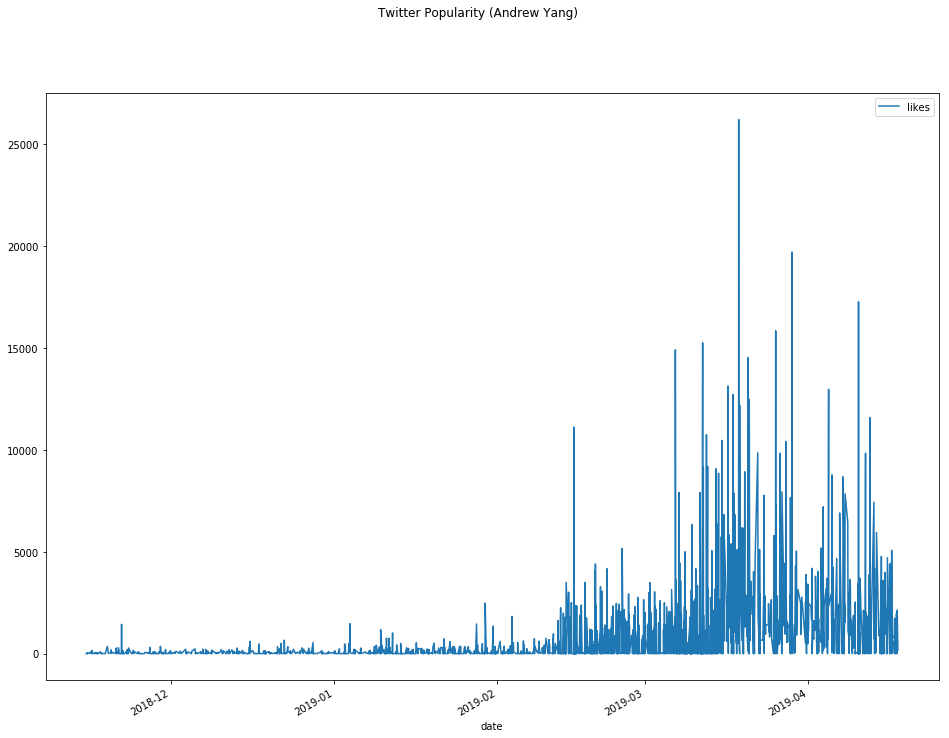

As you can see, Andrew Yang is only just now starting to gain some notoriety. It is also important to note, too, that Andrew Yang's popularity mostly comes from online communities, such as Twitter and Reddit, so this graph may not be representative of his actual popularity.

Next, let us look at Bernie Sanders.

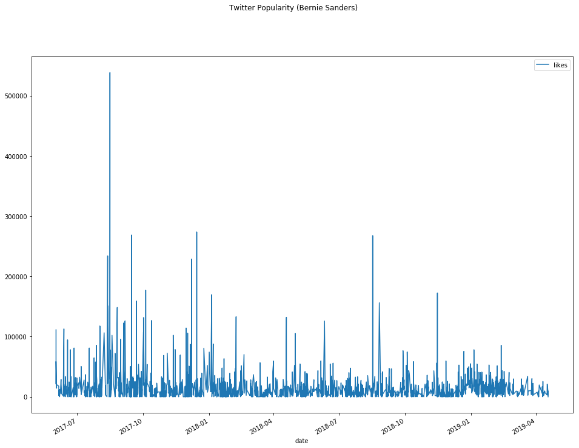

Here, we see the inverse trend. Bernie Sanders used to have a lot of popularity, but recently, all his popularity has waned.

Finally, moving onto Trump.

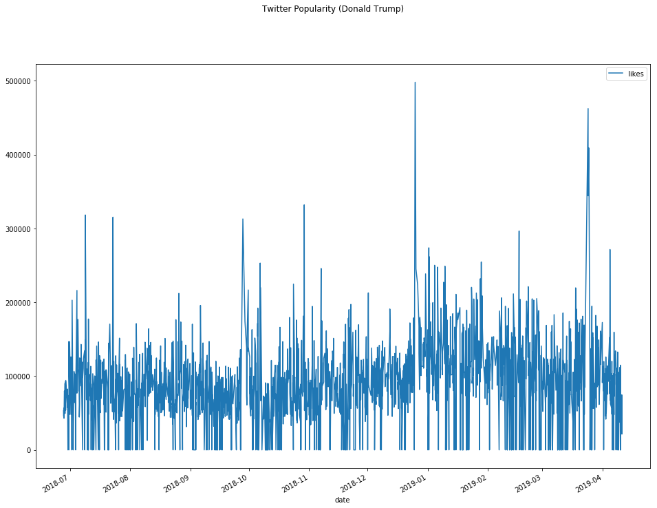

As we see, Trump has probably the most consistently high popularity. In particular, his numbers dwarf either candidate in their height. Remember, though, that everyone is focused on Trump as the Republican cadidate, while divided between some 20+ different Democratic candidates.

# Twitter Follower Counts

Next, we look at relative follower counts between various candidates.

So, in this analysis, I did the following. I gathered around 40,000 of each candidates Twitter followers. I could not by any stretch get everyone due to limitations in Twitter's API. Next, I checked each candidate's location. This is completely self reported, causing two issues.

1. Not everyone puts their location in, and they may not be honest.
2. I had to create a parser to determine if they were in the United States, and if so, what state. Using NLP creates inherent issues.

Intuitively, neither issue should cause a huge bias the results.

Next, of the followers I could determine whose State they were from, I calculated which states each percentage of their users come from.

Note this is NOT taking into account the total popularity of each candidate, just relative popularity. Much of this could even out in the end no matter which candidate is picked, in which his or her presence might become more well known.

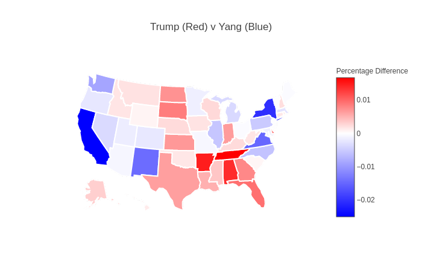

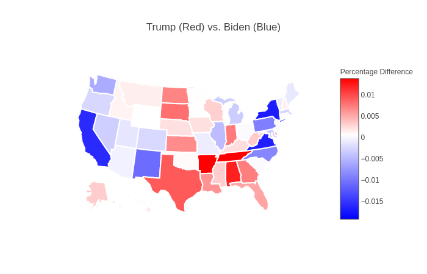

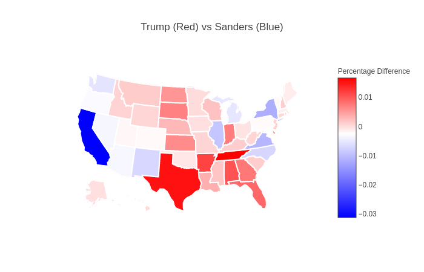

We see here some very interesting results. While some strong-hold blue states, Andrew Yang has a very strong lead (surpise, surpise). However, in several traditional red states, Andrew Yang holds a surpising amount of popularity.

For instance, Arizona is a traditionally red state, in about eveningly split now. Even places such as Texas, Andrew Yang has a surpising presence. With this said, if Andrew Yang becomes the democratic nominee, it could be possible that many traditionally red states will become swing-states.

# Comparisons

We shall now focus on comparing the various democratic nominees together. The current democratic frontrunner will be in blue, while red denotes a competitor.

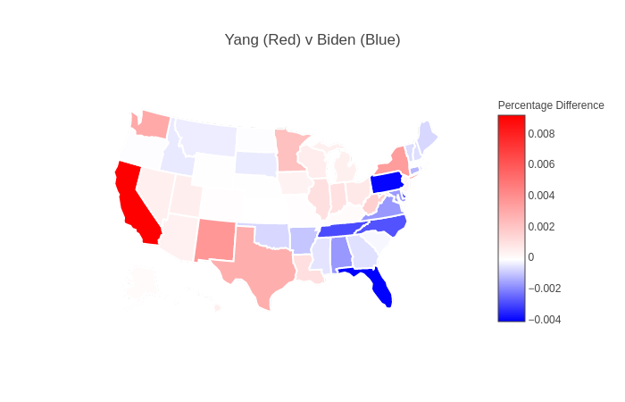

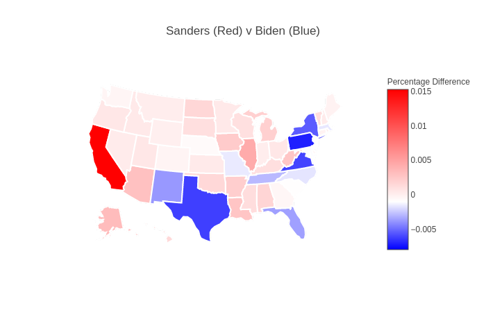

A few things of note. First, California is a major stronghold for both competitors of Biden. Next, in Texas and New Mexico, Sanders is not very popular, but seems to have a particular fondness for Yang. Lastly, Biden seems to have a pretty good stronghold all over the east-coast.

# Twitter Topics

Next, let's see what each candidate is talking about. To do this, we grab their last several thousand tweets, and analysize which Hashtag movements they were advocating for.

## Andrew Yang
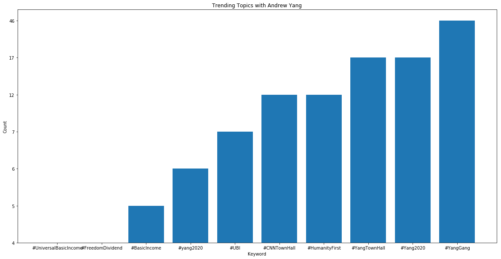

Note that he still goes under the main movement #YangGang and #Yang2020, which are prominant hashtag movements supporting his Democratic presidential bid. Also prominant are #HumanityFirst, which is in regards to his discussion of automation taking over jobs, and #UBI, which is on universal basic income.

## Bernie Sanders
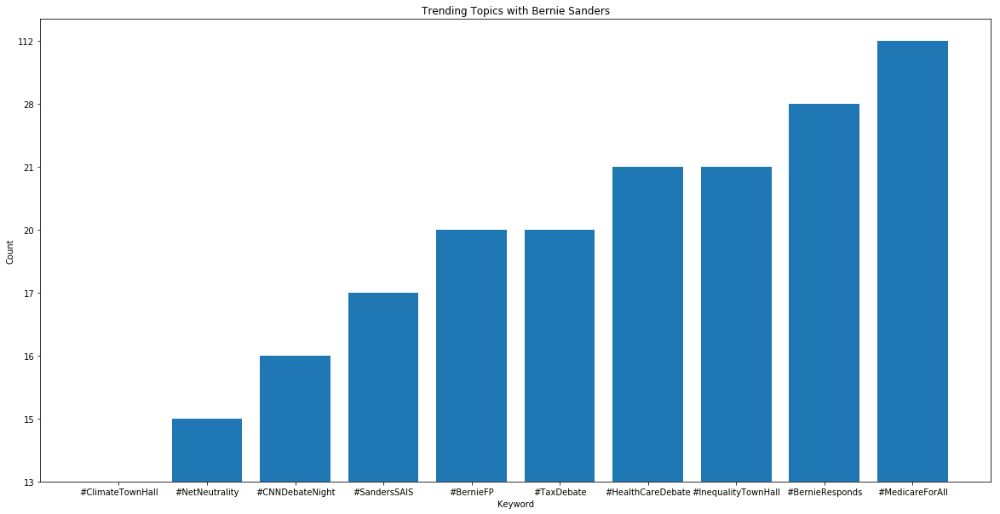

Here, we see a lot of discussion around health care as well as taxes.

## Joe Biden
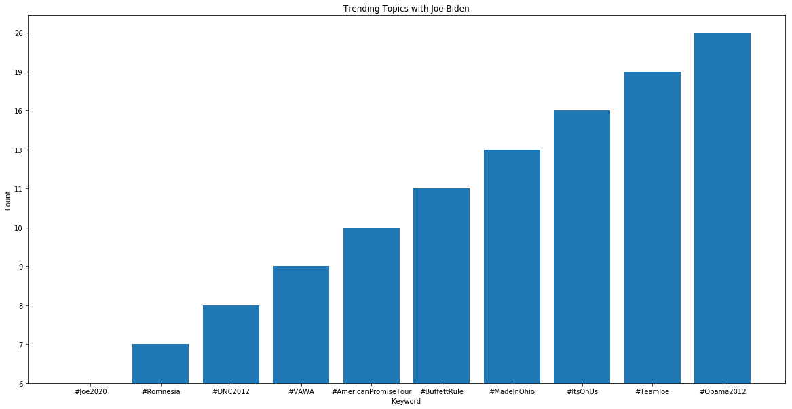

Joe Biden may be, for lack of better term, just boring. So, no real issues are brought up with any of his hashtag movements. Everything seen is all just campaign related. With that, said, this may change in the future if he wins the democratic ticket.

## Donald Trump
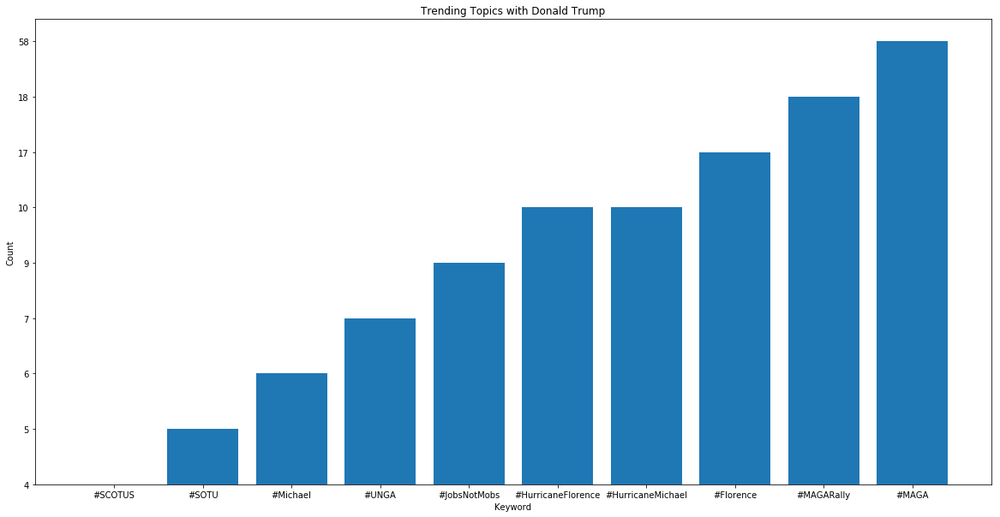

Again, his most prominant movement is #MEGA, which is in support of his presidential campaign. Also important are #JobsNotMobs, #Florence, and #Michael. The later of which refers to Michael Cohen.

# LDA

I generated LDA topic dashboards using pyLDAvis for [Bernie Sanders](./pyldavis-dashboards/sanders.html), [Andrew Yang](./pyldavis-dashboards/yang.html), and [Donald Trump](./pyldavis-dashboards/trump.html).

Here, we see that Andrew Yang is very much interested in universal basic income (top #1), education and economic factors (topic #2), and his presidential run (topic #3).

Looking at Joe Biden, many of these issues are dating back to his days serving as Vice President to Barack Obama. Outside the election, a lot seems to be focused on education (topic #8), jobs (topic #9), and concerns about sexual harassment (topic #10). As a side note, the last topic is likely unrelated to his recent encounter with the #MeToo movement, with several words being intermixed that date far prior.

Here, we see that Bernie Sanders is mostly concerned with health care (topic #1) as well as income inequality (topic #2). These two issues are probably what his platform is also most known for.

Here, we see that Trump is most interested in topics such as election results and fake news (topic #1), border security (topic #2), and the Russia investigation (topic #3).